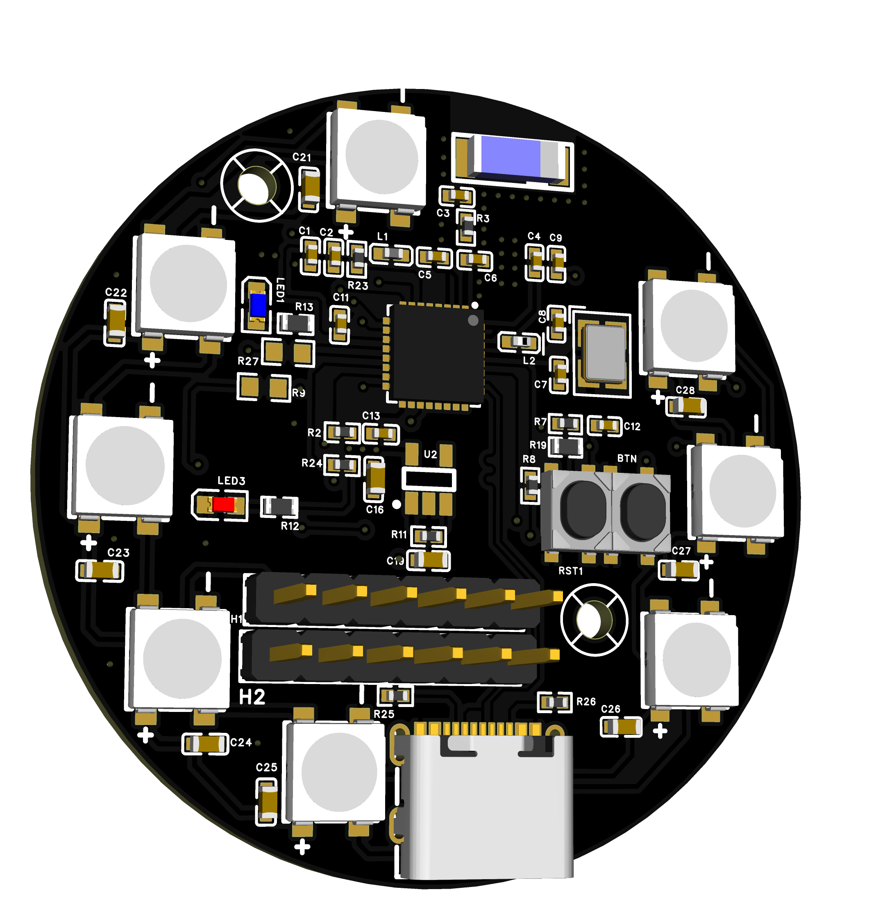
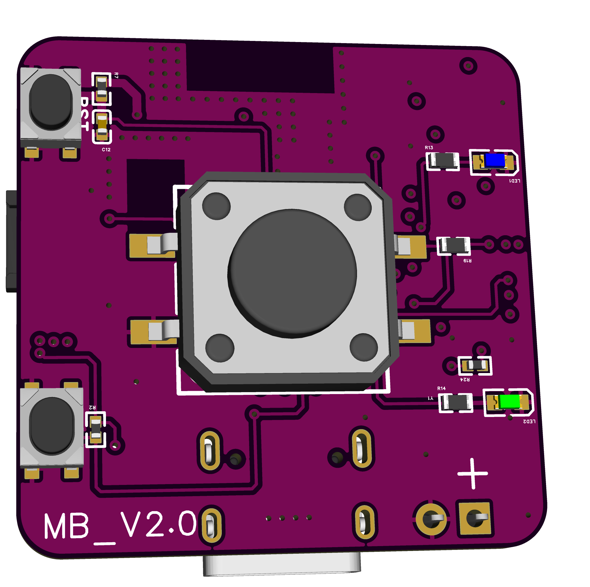

# ESP32C3Lamp

​	ESP32C3Lamp 硬件适用于拓竹的台灯模型。台灯模型[下载链接](https://makerworld.com/zh/models/13717?from=search#profileId-13429)。

## Hardware

### C3Lamp

### MagicButton

## Software

​    首先需要烧录 micropython 固件，使用到的固件存放在主仓库中。

### C3Lamp

​	使用 micropython 编写的主控程序，能够使用 espnow 来接收 MagicButton 发送的数据。

### MagicButton

  使用 micropython 编写的 espnow 发送程序代码。

